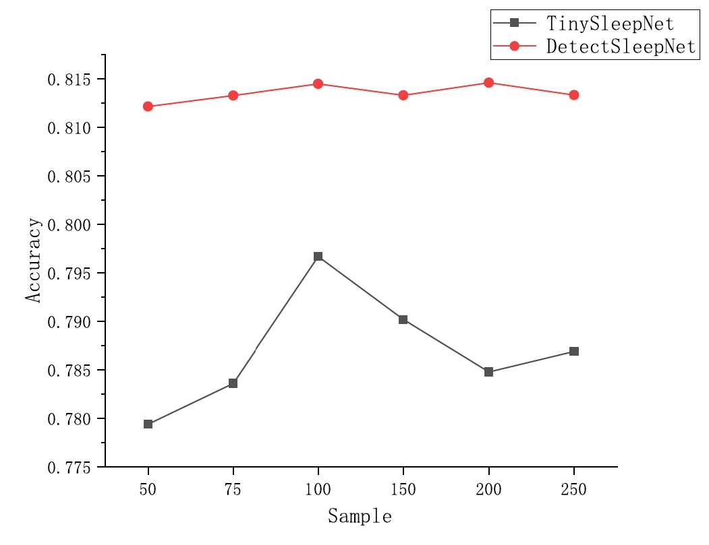
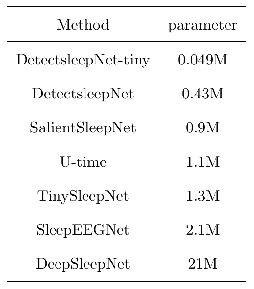

# DetectSleepNet
## A simple, efficient, and interpretable sleep staging method (SOTA)

<table><thead>
  <tr>
    <th colspan="2" rowspan="2">Dataset</th>
    <th colspan="3">Overall</th>
    <th colspan="5">F1 score</th>
  </tr>
  <tr>
    <th>OA</th>
    <th>MF1</th>
    <th>k</th>
    <th>W</th>
    <th>N1</th>
    <th>N2</th>
    <th>N3</th>
    <th>R</th>
  </tr></thead>
<tbody>
  <tr>
    <td rowspan="5">Physio2018</td>
    <td>DetectSleepNet</td>
    <td><b>80.9<b></td>
    <td><b>79.0<b></td>
    <td><b>0.739<b></td>
    <td><b>84.6<b></td>
    <td><ins>59.0<ins></td>
    <td><ins>85.1<ins></td>
    <td><b>80.2<b></td>
    <td><b>86.3<b></td>
  </tr>
  <tr>
    <td>SleePyCo</td>
    <td>80.9</td>
    <td>78.9</td>
    <td>0.737</td>
    <td>84.2</td>
    <td>59.3</td>
    <td>85.3</td>
    <td>79.4</td>
    <td>86.3</td>
  </tr>
  <tr>
    <td>XSleepNet</td>
    <td>80.3</td>
    <td>78.6</td>
    <td>0.732</td>
    <td>-</td>
    <td>-</td>
    <td>-</td>
    <td>-</td>
    <td>-</td>
  </tr>
  <tr>
    <td>SeqSleepNet</td>
    <td>79.4</td>
    <td>77.6</td>
    <td>0.719</td>
    <td>-</td>
    <td>-</td>
    <td>-</td>
    <td>-</td>
    <td>-</td>
  </tr>
  <tr>
    <td>U-time</td>
    <td>78.8</td>
    <td>77.4</td>
    <td>0.714</td>
    <td>82.5</td>
    <td>59.0</td>
    <td>83.1</td>
    <td>79.0</td>
    <td>83.5</td>
  </tr>
  <tr>
    <td rowspan="6">SHHS</td>
    <td>DetectSleepNet</td>
    <td><b>88.1<b></td>
    <td><b>80.8<b></td>
    <td><b>0.833<b></td>
    <td>93</td>
    <td>49</td>
    <td>89</td>
    <td>85</td>
    <td>89</td>
  </tr>
  <tr>
    <td>SleePyCo</td>
    <td>87.9</td>
    <td>80.7</td>
    <td>0.830</td>
    <td>92.6</td>
    <td>49.2</td>
    <td>88.5</td>
    <td>84.5</td>
    <td>88.6</td>
  </tr>
  <tr>
    <td>SleepTransformer</td>
    <td>87.7</td>
    <td>80.1</td>
    <td>0.828</td>
    <td>92.2</td>
    <td>46.1</td>
    <td>88.3</td>
    <td>85.2</td>
    <td>88.6</td>
  </tr>
  <tr>
    <td>XSleepNet</td>
    <td>87.6</td>
    <td>80.7</td>
    <td>0.826</td>
    <td>92.0</td>
    <td>49.9</td>
    <td>88.3</td>
    <td>85.0</td>
    <td>88.2</td>
  </tr>
  <tr>
    <td>IITNet</td>
    <td>86.7</td>
    <td>79.8</td>
    <td>0.812</td>
    <td>90.1</td>
    <td>48.1</td>
    <td>88.4</td>
    <td>85.2</td>
    <td>87.2</td>
  </tr>
  <tr>
    <td>SeqSleepNet</td>
    <td>86.5</td>
    <td>78.5</td>
    <td>0.81</td>
    <td>-</td>
    <td>-</td>
    <td>-</td>
    <td>-</td>
    <td>-</td>
  </tr>
</tbody></table>

**Tab1. Benchmarking against recent state-of-the-art methods**

**Fig1. EEG data with different adoption rates**

**Fig2. The number of model parameters for different methods**